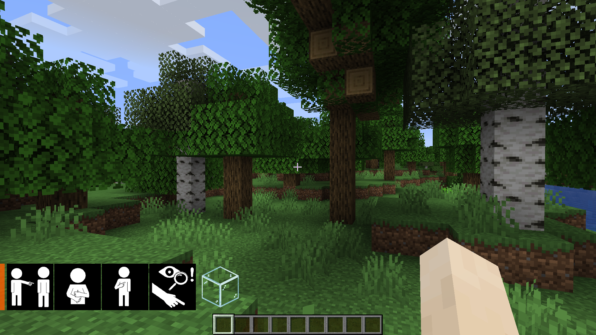
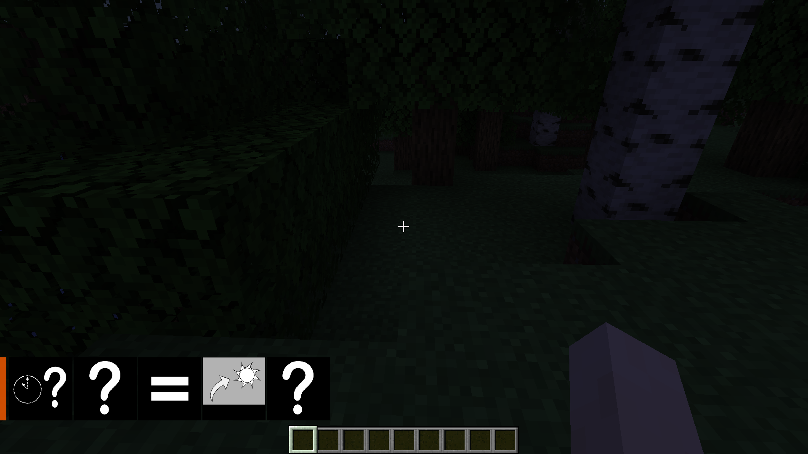
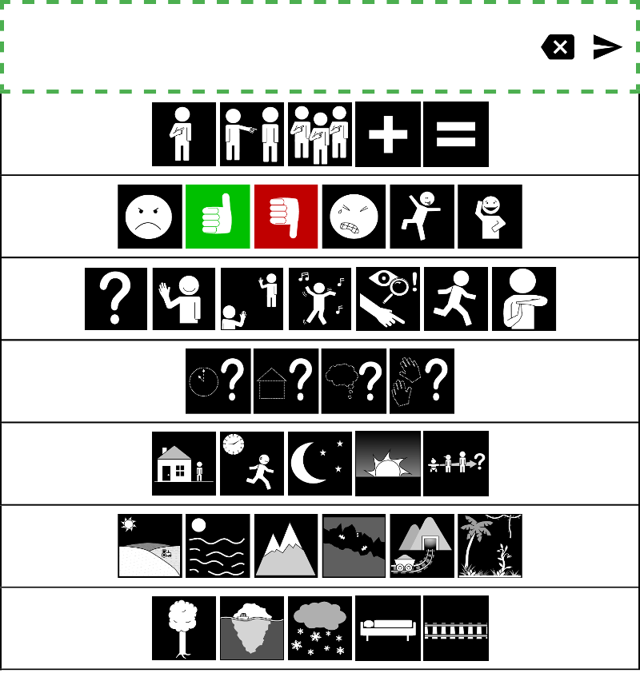

#  Pictocraft

Adds [PECS](https://en.wikipedia.org/wiki/Picture_exchange_communication_system) [AAC](https://en.wikipedia.org/wiki/Augmentative_and_alternative_communication) (image based alternate communication) to Minecraft Java multiplayer. Provides in-game message translation to [Sclera](https://sclera.be/en/vzw/home) images as well as a web interface for PECS input on a tablet or mobile phone, available at https://edeetee.github.io/pictocraft/.

## Features
- Translates multiplayer messages into PCS images using [Text2Picto](http://picto.ccl.kuleuven.be/index.php)
- [Web interface](https://edeetee.github.io/pictocraft/) for message input on a touchscreen device
- Displays mentioned minecraft blocks and items
- Random color identifiers for players

## Installation

### [Download the Pictocraft installer](https://github.com/edeetee/pictocraft-installer/blob/master/README.md)

Messages sent from other players will be displayed as PCS images and the Minecraft pause screen will display information on how to connect to your touch device.

Tested on Minecraft Java Edition 1.14+

Alternatively, [download the latest release](https://github.com/edeetee/pictocraft/releases) if you already have [fabric](https://fabricmc.net/) installed.

## Examples
### 'Can you help me find some glass'

### 'When will it be dawn?'

### PCS Input Interface on iPad

#### Test it on your device by going to https://edeetee.github.io/pictocraft?test

## How does it work?
### [Text2Picto](http://picto.ccl.kuleuven.be/index.php)
This mod wouldn't be possible without this translation technology. Its images are [Sclera Symbols](https://sclera.be/en/vzw/home).
### [Fabric-mc](https://fabricmc.net/)
Fabric is a set of java programs that let us program mods for minecraft mostly version-independent.

#### Special thanks to the fabric-mc discord
[Development.md](DEVELOPMENT.md)

---

## If you encounter any problems or want to give suggestions, please contact me at [my email address](mailto:edeetee@gmail.com) or make [a github issue](https://github.com/edeetee/pictocraft/issues)

### [Made by Edward Taylor](https://edeetee.github.io/)
